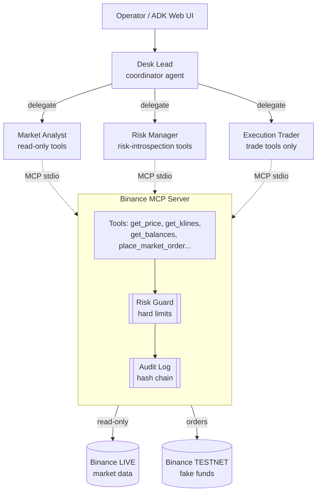

# Sentinel Desk — a multi-agent crypto trading desk you can actually trust with money

### A Google ADK trading agent for Binance, where every order must clear a deterministic risk gate and lands in a tamper-evident audit log.

> **Track:** Agents for Business — there is cost and revenue on the line.
> **Trading mode:** orders execute on the **Binance Spot Testnet** (fake funds); real, live Binance data drives the analysis. No real money is ever at risk.

---

## The problem

"Let an LLM trade crypto for me" is equal parts exciting and terrifying. The exciting part is obvious: a tireless analyst that reads the order book, reasons about momentum, and acts in seconds. The terrifying part is just as obvious: **an LLM is non-deterministic, and money is very deterministic.** A hallucinated quantity, a misread ticker, a prompt injection buried in a news headline, or simply an over-eager model can drain an account in one bad tool call.

Most "AI trading bot" demos paper over this. They hand the model an API key with full trading permissions and hope the prompt is good enough. That is not a business-grade system — it is a liability with a chat interface.

The real problem isn't "can an agent trade?" It's **"can an agent trade under controls strong enough that a business would sign off on it?"** That means least privilege, hard limits the model cannot talk its way around, and an audit trail that proves what happened.

## The solution

**Sentinel Desk** is a multi-agent trading desk built on **Google ADK 2.0**. It mirrors how a real trading desk is organized — separation of duties — and enforces that separation in code:

- A **Market Analyst** agent researches live Binance data and produces a BUY/SELL/HOLD thesis. It has *read-only* tools and literally cannot place a trade.
- A **Risk Manager** agent vets and sizes the proposed trade against the desk's risk posture. It also cannot trade.
- An **Execution Trader** agent is the *only* agent with order tools, and it places orders on the **testnet**.
- A **Desk Lead** coordinator orchestrates the three, delegating in sequence and summarizing the outcome.

The agents reach Binance exclusively through a dedicated **MCP server** that wraps the exchange API as tools. The security controls live *inside that server* — so even a jailbroken agent hits the same wall:

1. **Two separated clients.** The only client wired to trading endpoints points at the testnet. The live client is read-only. Real funds are structurally unreachable.
2. **A deterministic risk guard.** Every order passes hard limits — max notional, max open exposure, allowed symbols, daily order cap, and a daily-loss kill switch — enforced in plain Python loaded from config. The LLM can *reason* about risk; it cannot *override* it.
3. **A tamper-evident audit log.** Every risk decision and fill is appended to a JSONL log with a SHA-256 hash chain, so altering any past record invalidates every record after it.

## Architecture



**Flow of a trade request:** Desk Lead → Market Analyst (thesis from live data) → Risk Manager (verdict + sizing) → Execution Trader → `place_market_order` on the MCP server → **risk guard check** → audit record → testnet fill → audit record → summary back to the operator.

Each agent connects to the MCP server with a **`tool_filter`** so it sees only the tools its role needs — least privilege at the protocol layer. The analyst's process literally has no `place_market_order` tool exposed to it.

### Why this maps to the technical requirements

| Requirement | Where it lives |
|---|---|
| **Agent / Multi-agent system (ADK)** | `src/trading_agent/agents/` — coordinator + 3 specialists; both an LLM-delegation `LlmAgent` root and a deterministic `SequentialAgent` pipeline |
| **MCP Server** | `src/trading_agent/binance_mcp/server.py` — FastMCP server exposing Binance as tools over stdio |
| **Security features** | Two-client isolation, `RiskGuard` hard limits, hash-chained `AuditLog`, per-agent `tool_filter`, secrets only in `config.py`, non-root container |
| **Deployability** | `Dockerfile` + `docker-compose.yml` (serves the ADK web UI), GitHub Actions CI (lint + tests + image build), `Makefile` |

## Security model in detail

This is the heart of the project, so it's worth being explicit.

- **Funds isolation by construction.** `binance_mcp/client.py` builds two clients. `trader` (testnet) is the only one with `create_order`. `market` (live) is used for prices/klines/order book. There is no code path from an agent to a live order.
- **Read-only live keys.** The setup instructions tell you to create live API keys with trading and withdrawals **disabled**. Even those keys can only read.
- **Hard limits the model can't argue with.** `security/risk_guard.py` rejects any order that breaks: single-order notional cap, total open-exposure cap, symbol allow-list, daily order count, or the daily realized-loss kill switch. Counters are persisted to disk, so a restart can't reset the kill switch.
- **Defense in depth.** The Risk Manager *agent* vets trades, *and* the MCP server re-checks every order server-side. Two independent gates, one deterministic.
- **Tamper-evident audit.** `security/audit.py` chains records with SHA-256; `verify()` walks the chain and fails if a single byte was altered. Tested in `tests/test_audit.py`.
- **Master kill switch.** `TRADING_ENABLED=false` turns the whole desk into analysis-only.

## Setup

### Prerequisites
- Python 3.11+ (or Docker)
- A **Google AI Studio** API key for Gemini: <https://aistudio.google.com/apikey>
- **Binance Spot Testnet** keys: <https://testnet.binance.vision/>
- *(Optional)* live Binance API keys with **trading & withdrawals disabled**, for richer live data. Public market data needs no keys.

### Configure
```bash
cp .env.example .env
# Fill in GOOGLE_API_KEY and BINANCE_TESTNET_API_KEY / _SECRET.
# Tune the RISK_* limits to taste.
```

### Run locally
```bash
python -m venv .venv && source .venv/bin/activate
pip install -e ".[dev]"
pytest -q                       # 12 tests, security layer

# One-shot via the CLI:
trading-agent "Analyze BTCUSDT and, if it's a safe buy, trade a tiny amount"
trading-agent --mode pipeline "Evaluate ETHUSDT for a 0.001 ETH buy"

# Or the ADK web dev UI (watch the agents delegate live):
make web        # http://localhost:8000
```

### Run with Docker
```bash
docker compose up --build       # ADK web UI on http://localhost:8000
```

### Run the MCP server standalone
```bash
make mcp        # speaks MCP over stdio; point any MCP client at it
```

## Usage examples

```text
$ trading-agent "What's the price of BNBUSDT?"
[market_analyst] BNBUSDT is trading at 612.40 ...

$ trading-agent "Analyze BTCUSDT and buy 0.001 if it's a safe entry"
  → [market_analyst] calls tool: get_24h_stats({'symbol': 'BTCUSDT'})
  → [market_analyst] calls tool: get_klines({'symbol': 'BTCUSDT', 'interval': '1h'})
[market_analyst] direction: BUY, conviction: medium ...
  → [risk_manager] calls tool: get_risk_status({})
[risk_manager] verdict: APPROVE — notional within the 100 USDT cap ...
  → [execution_trader] calls tool: place_market_order({'symbol': 'BTCUSDT', 'side': 'BUY', 'quantity': 0.001})
[execution_trader] EXECUTED on testnet, order id 12345, filled 0.001 BTC.
```

When an order breaks a limit, the guard refuses it and the trader reports the reason verbatim — e.g. `REJECTED: MAX_NOTIONAL_EXCEEDED: 250.00 > 100.00 USDT`.

## Project journey

I came in with a Node.js/Redis/Docker background, so the first decision was the agent stack. I chose **Python + Google ADK** specifically to fit the track's "Agent/Multi-agent (ADK)" requirement and to use ADK's first-class multi-agent and MCP support, even though it meant working outside my home turf.

The design pivot that mattered was realizing the security story shouldn't live in the prompts. My first instinct was "tell the risk agent to be careful." That's not good enough for money — prompts are suggestions. So I pushed the controls down into deterministic code at the **MCP tool boundary**, and made the agents' good behavior a *second* layer rather than the only one. That's why `place_market_order` re-runs the risk check server-side regardless of what the agents decided.

The second insight was **least privilege via `tool_filter`**: instead of one shared toolset, each agent connects to the MCP server seeing only its own tools. The analyst can't trade because the trade tool isn't in its process, full stop.

The trickiest practical bit was ADK plumbing on a bleeding-edge Python (3.14 locally), and getting `adk web` to discover the coordinator — solved with a small `adk_agents/desk` app shim, verified by hitting `/list-apps`. The audit hash-chain was the most satisfying piece: a few lines of SHA-256 chaining turns a log file into something you can *prove* wasn't edited, and the tamper test demonstrates it.

If I kept going: portfolio-level position sizing, limit/stop orders, a Redis-backed shared risk state for multi-process consistency, and an A2A interface so other agents could consult the desk.

## Project layout
```
src/trading_agent/
  config.py                 # typed settings, risk limits, single secret surface
  binance_mcp/
    client.py               # two separated Binance clients (live RO / testnet trade)
    server.py               # FastMCP server: Binance tools + risk + audit
  security/
    risk_guard.py           # deterministic hard limits, persisted daily counters
    audit.py                # append-only JSONL with SHA-256 hash chain
  agents/
    market_analyst.py       # read-only research
    risk_manager.py         # risk vetting & sizing
    execution_trader.py     # the only agent that can trade
    coordinator.py          # Desk Lead orchestrator + Sequential pipeline
    toolsets.py             # per-role least-privilege MCP toolsets
  cli.py                    # streaming CLI runner
adk_agents/desk/            # `adk web` discovery shim
tests/                      # risk-guard + audit tests
Dockerfile, docker-compose.yml, .github/workflows/ci.yml, Makefile
```

## Disclaimer
This project trades on the Binance **testnet** with fake funds and is for educational/demonstration purposes. It is **not** financial advice. If you wire it to live trading, you do so entirely at your own risk.
